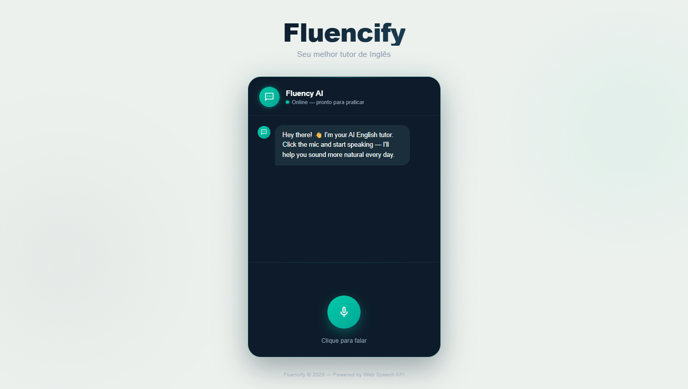
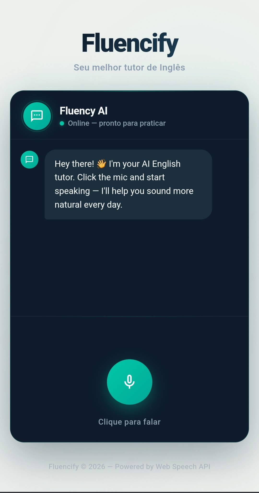

<div align="center">

# 🎙️ Fluencify

**Um tutor de inglês com IA que ouve você falar, corrige em tempo real e responde em voz alta — tudo no browser, sem instalar nada.**



[](https://tuliovitor.github.io/fluencify)
[](https://developer.mozilla.org/pt-BR/docs/Web/HTML)
[](https://developer.mozilla.org/pt-BR/docs/Web/CSS)
[](https://developer.mozilla.org/pt-BR/docs/Web/JavaScript)
[](https://n8n.io)

</div>

---

## 📌 Sobre o projeto

O **Fluencify** é um tutor de inglês conversacional que usa três APIs nativas do browser para criar uma experiência completa de prática oral: você fala, a IA responde com correções, e o áudio é lido de volta em voz sintetizada.

O projeto nasceu de uma pergunta real: *é possível construir um tutor de idiomas funcional só com HTML, CSS e JS vanilla — sem React, sem backend próprio, sem SDK?*

A resposta foi sim. O Fluencify usa:

- **Web Speech API** para captar e transcrever o que o usuário fala
- **N8N webhook** como orquestrador da IA (pode ser substituído por qualquer LLM)
- **SpeechSynthesis API** para responder em voz alta, detectando automaticamente trechos em PT-BR e inglês

Quando o webhook não está configurado, o app entra em modo **fallback** — respondendo com mensagens de encorajamento pré-definidas — para que o projeto funcione como demo em qualquer ambiente.

---

## 🎬 Demonstração

| Desktop | Mobile |
|---|---|
|  |  |

---

## ✨ Funcionalidades

- **Reconhecimento de voz** via Web Speech API — clique no microfone e fale em inglês ou português
- **Chat em tempo real** com bolhas animadas, indicador de digitação e scroll automático
- **Correções contextuais** exibidas como dicas logo abaixo da resposta da IA
- **TTS bilíngue** — a IA lê a resposta em voz alta, trocando automaticamente de voz quando o trecho muda de idioma
- **Detecção de idioma por segmento** — frases em PT-BR e inglês dentro da mesma resposta são lidas com a voz correta para cada uma
- **Modo fallback offline** — funciona sem webhook, com respostas de encorajamento aleatórias
- **Waveform animado** — visualizador de barras que aparece enquanto o microfone está ativo
- **Pulse rings** no botão do microfone durante a gravação
- **Acessibilidade** — `aria-live`, `aria-label`, `role="log"` e suporte a `prefers-reduced-motion`
- **Totalmente responsivo** — layout adaptado para mobile e desktop com uma única página

---

## 🧱 Stack

| Tecnologia | Uso |
|---|---|
| HTML5 semântico | Estrutura única (`index.html`) com atributos ARIA completos |
| CSS3 com design tokens | Sistema de cores, animações e responsividade via custom properties |
| JavaScript vanilla (IIFE) | Toda a lógica encapsulada em módulo autoexecutável |
| Web Speech API | Reconhecimento de voz (`SpeechRecognition`) |
| SpeechSynthesis API | Leitura em voz alta com seleção de voz por idioma |
| N8N | Webhook que roteia a mensagem para um LLM e retorna `reply` + `correction` |

> Nenhuma dependência de frontend. Zero `npm install`. Um único `index.html`.

---

## 🗂️ Estrutura do projeto

```
fluencify/
├── index.html      # Estrutura completa com marcação ARIA
├── styles.css      # Design system, animações e responsividade
└── scripts.js      # Speech Recognition, TTS bilíngue e integração N8N
```

---

## 🧠 Decisões técnicas

### TTS bilíngue com detecção de segmento

O maior desafio técnico do projeto. Quando a IA responde com frases mistas — parte em inglês, parte com termos em português — usar uma única voz soa artificial. A solução foi dividir o texto em segmentos por idioma antes de sintetizar:

```javascript
function splitByLanguage(text) {
  const sentences = text.split(/(?<=[.!?\n])\s*/);
  const segments = [];
  let currentLang = null;
  let currentText = '';

  for (const sentence of sentences) {
    const lang = isPtBr(sentence) ? 'pt-BR' : 'en-US';
    if (lang === currentLang) {
      currentText += ' ' + sentence;   // acumula frases do mesmo idioma
    } else {
      if (currentText.trim()) segments.push({ text: currentText.trim(), lang: currentLang });
      currentLang = lang;
      currentText = sentence;
    }
  }
  // ...
}
```

Cada segmento é enfileirado como um `SpeechSynthesisUtterance` separado, com a voz correta para aquele idioma.

---

### Detecção de PT-BR sem biblioteca externa

Em vez de usar uma biblioteca de detecção de idioma, a função `isPtBr()` combina dois sinais: presença de caracteres acentuados típicos do português e uma lista de palavras funcionais comuns (sem necessidade de acento para funcionar):

```javascript
function isPtBr(segment) {
  if (/[àáâãéêíóôõúç]/i.test(segment)) return true;
  const ptWords = /\b(você|voce|eu|quero|como|falar|não|nao|...)\b/i;
  return ptWords.test(segment);
}
```

Isso garante que até usuários que digitam sem acento sejam detectados corretamente.

---

### Módulo IIFE para escopo limpo

Todo o JavaScript está encapsulado em uma IIFE (`(() => { ... })()`), evitando poluição do escopo global sem precisar de bundler ou módulos ES6:

```javascript
(() => {
  'use strict';
  // toda a lógica aqui — nenhuma variável vaza para window
})();
```

---

### Fallback gracioso quando o webhook falha

O `catch` do `sendToN8N` não mostra uma mensagem de erro genérica — ele escolhe aleatoriamente entre quatro respostas de encorajamento, mantendo a experiência funcional como demo mesmo sem IA conectada:

```javascript
const fallback = fallbackResponses[Math.floor(Math.random() * fallbackResponses.length)];
addMessage('ai', fallback.reply, fallback.correction);
speak(fallback.reply);
```

---

### Escaping seguro de HTML nas mensagens

O texto transcrito pelo usuário nunca vai direto para `innerHTML`. A função `escapeHtml()` converte o texto para nó DOM e extrai o `innerHTML` seguro, prevenindo XSS:

```javascript
function escapeHtml(str) {
  const div = document.createElement('div');
  div.textContent = str;
  return div.innerHTML;
}
```

---

## ⚙️ Configurando o N8N

O webhook do N8N recebe um `POST` com `{ message, lang }` e deve retornar:

```json
{
  "reply": "That's great! Try saying it with more emphasis on the first syllable.",
  "correction": "Optional: a grammar or pronunciation tip goes here."
}
```

Para conectar ao seu próprio N8N, substitua a URL no topo de `scripts.js`:

```javascript
const N8N_WEBHOOK_URL = 'https://seu-usuario.app.n8n.cloud/webhook/fluencify';
```

Sem essa configuração, o app funciona normalmente no modo fallback.

---

## 📈 Processo de desenvolvimento

| Etapa | O que foi feito |
|---|---|
| 01 | Design system em CSS com tokens, animações e layout responsivo |
| 02 | Estrutura HTML com marcação ARIA e componentes estáticos |
| 03 | Implementação do `SpeechRecognition` e estados do microfone |
| 04 | Integração com N8N webhook e tratamento de erros |
| 05 | TTS básico com `SpeechSynthesis` |
| 06 | Detecção de idioma por segmento e TTS bilíngue |
| 07 | Modo fallback e respostas aleatórias de encorajamento |
| 08 | Waveform animado, pulse rings e refinamentos visuais |
| 09 | Testes mobile e ajuste de acessibilidade |

---

## 💡 O que eu aprenderia diferente

- Teria implementado o `splitByLanguage` desde o início, antes do TTS básico — refatorar depois exigiu repensar toda a lógica de enfileiramento de utterances
- Teria testado os estados de erro do `SpeechRecognition` (`no-speech`, `not-allowed`) logo nos primeiros testes, não só no final
- Teria separado a detecção de idioma em um módulo próprio desde o começo — ela cresceu e hoje merecia seu próprio arquivo

---

## 👨‍💻 Autor

**TULIO VITOR**

[](https://linkedin.com/in/tuliovitor)
[](https://github.com/tuliovitor)

---

<div align="center">

Feito com muito ☕ e muito 🎙️

</div>
